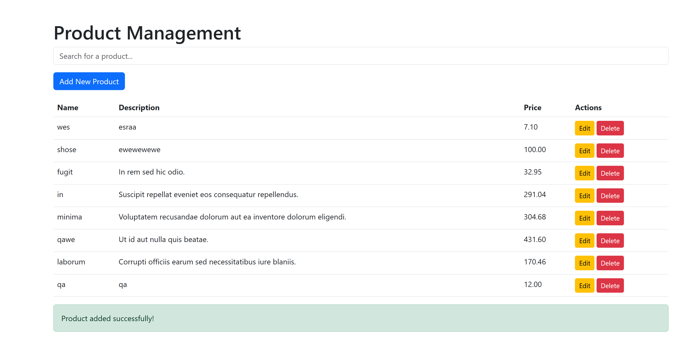

# Product Management System

This is a Laravel-based product management system that allows you to perform CRUD operations (Create, Read, Update, Delete) for products. It includes Livewire components for real-time product management and an API controller for managing products through RESTful API requests.

## Features

- **CRUD Operations**: Add, edit, delete, and view products.
- **Search Functionality**: Search products by name and description.
- **Livewire Integration**: Use Livewire for real-time product management without page reloads.
- **API Endpoints**: Perform CRUD operations via API requests.

## Prerequisites

Ensure the following software is installed:

- [PHP 8.x](https://www.php.net/)
- [Composer](https://getcomposer.org/)
- [Laravel 8.x or above](https://laravel.com/)
- [MySQL or SQLite](https://www.mysql.com/) for database management

## Installation

Follow these steps to get your project up and running locally:

1. **Clone the repository**:
    ```bash
    git clone https://github.com/wesamqamar/Product-Management.git
    ```

2. **Navigate to the project directory**:
    ```bash
    cd product-management-system
    ```

3. **Install dependencies**:
    ```bash
    composer install
    ```

4. **Set up the `.env` file**:
    Copy `.env.example` to `.env` and configure your database connection.
    ```bash
    cp .env.example .env
    ```

5. **Generate the application key**:
    ```bash
    php artisan key:generate
    ```

6. **Run migrations**:
    ```bash
    php artisan migrate
    ```

7. **Seed the database (Optional)**:
    If you want to seed the database with product data, run the following:
    ```bash
    php artisan db:seed
    ```

8. **Run the application**:
    Start the local development server.
    ```bash
    php artisan serve
    ```
    Visit `http://localhost:8000` in your browser to view the application.

## Usage


## Screenshots

<div>
    </img> 
</div>
### ProductController (API)

The `ProductController` provides the following API endpoints for managing products:

- **Create a Product**:
    - Endpoint: `POST /api/products`
    - Request Body: 
        ```json
        {
            "name": "Product Name",
            "description": "Product Description",
            "price": 100.00
        }
        ```

- **Get All Products**:
    - Endpoint: `GET /api/products`
    - Query Parameters: `name`, `description` (optional filters)
    - Response:
        ```json
        [
            {
                "id": 1,
                "name": "Product 1",
                "description": "Description 1",
                "price": 100.00
            },
            ...
        ]
        ```

- **Get Product by ID**:
    - Endpoint: `GET /api/products/{id}`
    - Response:
        ```json
        {
            "id": 1,
            "name": "Product 1",
            "description": "Description 1",
            "price": 100.00
        }
        ```

- **Update a Product**:
    - Endpoint: `PUT /api/products/{id}`
    - Request Body:
        ```json
        {
            "name": "Updated Product Name",
            "description": "Updated Description",
            "price": 150.00
        }
        ```

- **Delete a Product**:
    - Endpoint: `DELETE /api/products/{id}`
    - Response:
        ```json
        {
            "message": "Product deleted successfully"
        }
        ```

### Livewire Product Management

The Livewire component provides a real-time interface to manage products:

- **Add Product**: Fill in the product name, description, and price to add a new product.
- **Edit Product**: Update the existing product details.
- **Delete Product**: Remove a product from the database.

### ProductFactory

The `ProductFactory` is used for seeding data for testing and development:

```php
namespace Database\Factories;

use Illuminate\Database\Eloquent\Factories\Factory;

class ProductFactory extends Factory
{
    public function definition()
    {
        return [
            'name' => $this->faker->word(),
            'description' => $this->faker->sentence(),
            'price' => $this->faker->randomFloat(2, 10, 500),  // Random price between 10 and 500
        ];
    }
}
